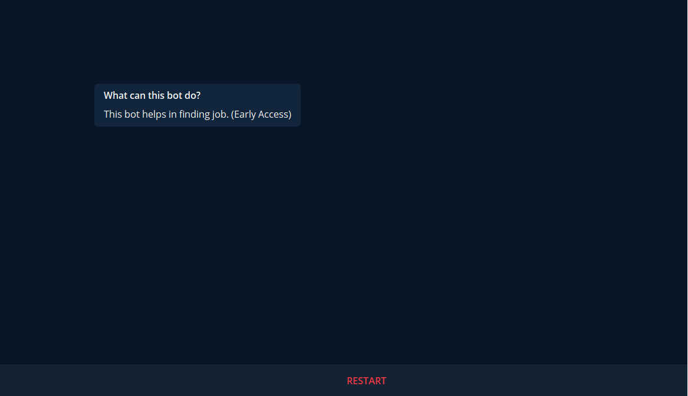

# Telegram bots app
## App speeds up process of finding job for general workers in UK, London.

### User fills his info through main bot, then this info in a beautiful way is sent to manager through second bot. Later manager contact worker with his offers.

**config.py** - File to configure your app. There you have to specify tokens for main and sub bots (***TOKEN, SUB_TOKEN***) and telegram id of a manager (***recipient_id***), which will receive information that employees have sent.

